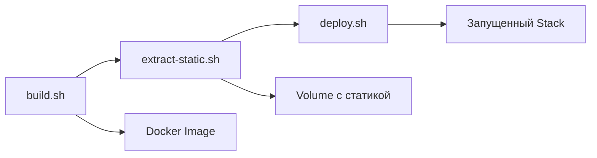

# 🚀 Horizont Scaling

Next.js приложение с Docker Swarm деплоем и модульными скриптами для CI/CD.

## 📁 Структура проекта

```
horizont-scaling/
├── app/                          # Next.js приложение
│   ├── src/
│   ├── package.json
│   └── next.config.ts
│
├── docker/                       # Docker конфигурация
│   ├── app/
│   │   └── Dockerfile           # Multi-stage build для Next.js
│   ├── docker-stack.yml         # Docker Swarm stack
│   └── nginx/
│       └── nginx.conf.template  # Nginx конфиг
│
├── .github/
│   └── workflows/
│       └── deploy.yml           # GitHub Actions workflow
│
├── build.sh                     # 🔨 Сборка Docker образа
├── extract-static.sh            # 📦 Извлечение статики
├── deploy.sh                    # 🚀 Деплой stack
├── scripts                      # 🔄 Полный цикл (все три)
├── test-workflow.sh             # 🎭 Тестирование GH Actions
│
├── DEPLOYMENT.md                # 📖 Полная документация деплоя
├── ACT_SETUP.md                 # 🎭 Инструкция по act
└── README.md                    # 👋 Этот файл
```

## ⚡ Быстрый старт

### Локальная разработка

```bash
# Полный цикл: сборка → статика → деплой
./scripts

# Или по отдельности
./build.sh
./extract-static.sh
./deploy.sh
```

### Тестирование GitHub Actions локально

```bash
# Установить act
brew install act

# Интерактивное тестирование
./test-workflow.sh

# Или напрямую
act -j build              # Только сборка
act push                  # Весь workflow
```

## 🔧 Конфигурация

Все параметры задаются через переменные окружения:

```bash
export STACK_NAME=app           # Имя Docker Stack
export NGINX_PORT=3000          # Внешний порт
export APP_PORT_LOCAL=3001      # Порт приложения
export GH_SHA=v1.0.0            # Версия образа
```

## 📚 Документация

- **[DEPLOYMENT.md](./DEPLOYMENT.md)** - Полная инструкция по деплою

  - Использование скриптов
  - GitHub Actions интеграция
  - Настройка портов
  - Отладка

- **[ACT_SETUP.md](./ACT_SETUP.md)** - Локальное тестирование GH Actions
  - Установка act
  - Примеры использования
  - Отладка
  - Best practices

## 🎯 Использование в CI/CD

### GitHub Actions

Workflow разделен на три job:

```yaml
jobs:
  build: # Сборка образа
  extract-static: # Извлечение статики
  deploy: # Деплой на сервер
```

Триггеры:

- `push` на tags `v*` (автоматически)
- `workflow_dispatch` (вручную с параметрами)

### Модульные скрипты

Каждый этап - отдельный скрипт:

| Скрипт              | Что делает                 | GH Actions Job   |
| ------------------- | -------------------------- | ---------------- |
| `build.sh`          | Собирает Docker образ      | `build`          |
| `extract-static.sh` | Извлекает статику в volume | `extract-static` |
| `deploy.sh`         | Деплоит Docker Stack       | `deploy`         |
| `scripts`           | Запускает все три          | -                |

## 🏗️ Архитектура

### Dockerfile

```dockerfile
ARG PORT=3001            # Порт при сборке
ENV PORT=${PORT}         # Переменная для Next.js
EXPOSE ${PORT}           # Документация порта
```

### docker-stack.yml

```yaml
services:
  app:
    environment:
      - PORT=${APP_PORT_LOCAL} # Порт приложения
    ports:
      - "9000:${APP_PORT_LOCAL}" # Маппинг портов
    volumes:
      - next_static:/app/.next/static:ro

  nginx:
    ports:
      - "${NGINX_PORT}:80" # Внешний порт
    volumes:
      - next_static:/static:ro
```

## 🔄 Workflow деплоя



### Локально

```bash
./scripts  # Запускает все три последовательно
```

### GitHub Actions

```
Job 1: Build         ─┐
Job 2: Extract Static─┤ Параллельно где возможно
Job 3: Deploy        ─┘
```

## 🎭 Локальное тестирование

```bash
# 1. Тестируем скрипты напрямую
./build.sh

# 2. Если работает - тестируем через act
act -j build

# 3. Полный workflow
act push

# 4. Деплоим в продакшн
git push
```

## 🐛 Отладка

```bash
# Проверить образы
docker images | grep horizont-app

# Проверить stack
docker stack ls
docker service ls

# Логи
docker service logs app_app -f
docker service logs app_nginx -f

# Остановить
docker stack rm app

# Очистить
docker system prune -a
```

## 🌟 Особенности

- ✅ **Модульность** - каждый этап независим
- ✅ **Переиспользование** - скрипты работают локально и в CI
- ✅ **Типизация** - TypeScript в Next.js
- ✅ **Multi-stage build** - оптимизированный Docker образ
- ✅ **Rolling updates** - zero-downtime деплой
- ✅ **Nginx** - для статики и балансировки
- ✅ **Docker Swarm** - простая оркестрация
- ✅ **act** - локальное тестирование CI

## 📝 Переменные окружения

| Переменная       | По умолчанию                  | Описание                          |
| ---------------- | ----------------------------- | --------------------------------- |
| `GH_SHA`         | `$(git tag --points-at HEAD)` | Версия/тег для образа             |
| `APP_PORT_LOCAL` | `3001`                        | Порт приложения внутри контейнера |
| `NGINX_PORT`     | `3000`                        | Внешний порт Nginx                |
| `STACK_NAME`     | `app`                         | Имя Docker Stack                  |

## 🤝 Contributing

1. Разработайте функционал
2. Протестируйте локально: `./scripts`
3. Протестируйте через act: `./test-workflow.sh`
4. Создайте Pull Request

## 📄 License

MIT
